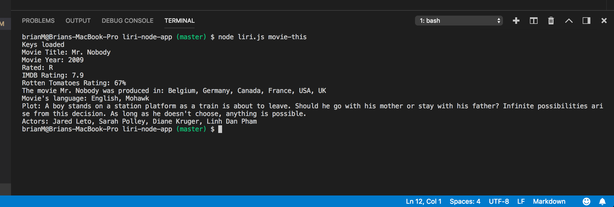
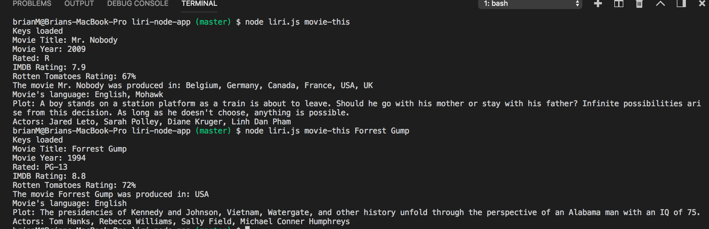
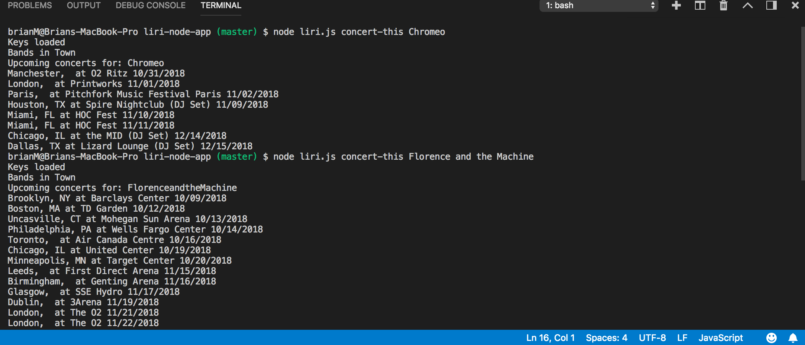
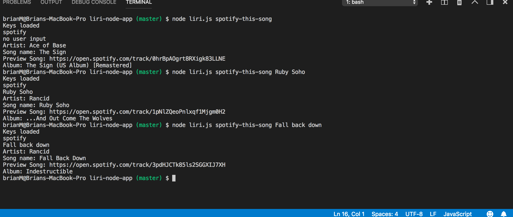

# liri-node-app
Liri-Node-App - HomeWork #8

[Video of my LIRI Node App](https://drive.google.com/file/d/1K-4nGJoLKarADztzfLuagFy6a_5Nc0ly/view)

In this homework assignment, I attempt to create a command line interface app that will fetch and display:

 1.song information with Spotify (based on keywords)

 2.movie info with OMDB (based on movie name)

 3.concert information with Bands In Town (based on artist name)

 Spotify requires a client ID and client secret which I want to keep hidden so I put them in a .env file and included a .gitignore file to make sure they are not deployed to my github.

TO RUN THESE FUNCTIONS ENTER [node liri.js ] and then the search parameter.

Here is my Omdb movie request function.

 1. This is my OMDB Movie request function when you do not define a movie. It is set to Mr. Nobody as default.

 

 2. Here I search for a two word movie
 
 

 3. Here is my Bands In Town request function. I search for a one word and multiple word artist to see their upcoming tour dates.

 

 This is my Spotify song look up function. Here I search for a couple multiple word songs and get their information.
 If no song is specified it will default to Ace of Base "The Sign".

 

If you type [node liri.js Do-What-It-Says] The app will read the command from the random.txt file and search Spotify 
for the Backstreet Boys Song "I Want it That Way"

 

 Thanks for checking out my Liri App.

